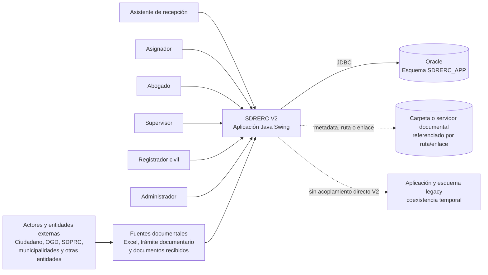
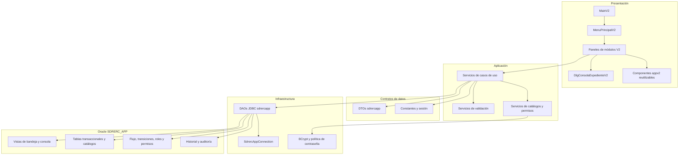
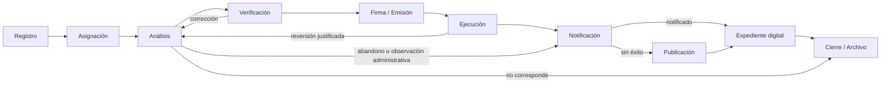
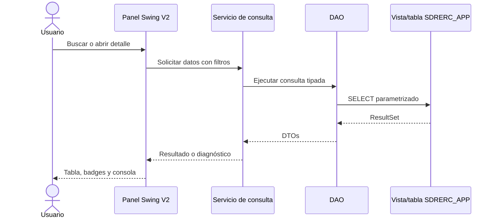
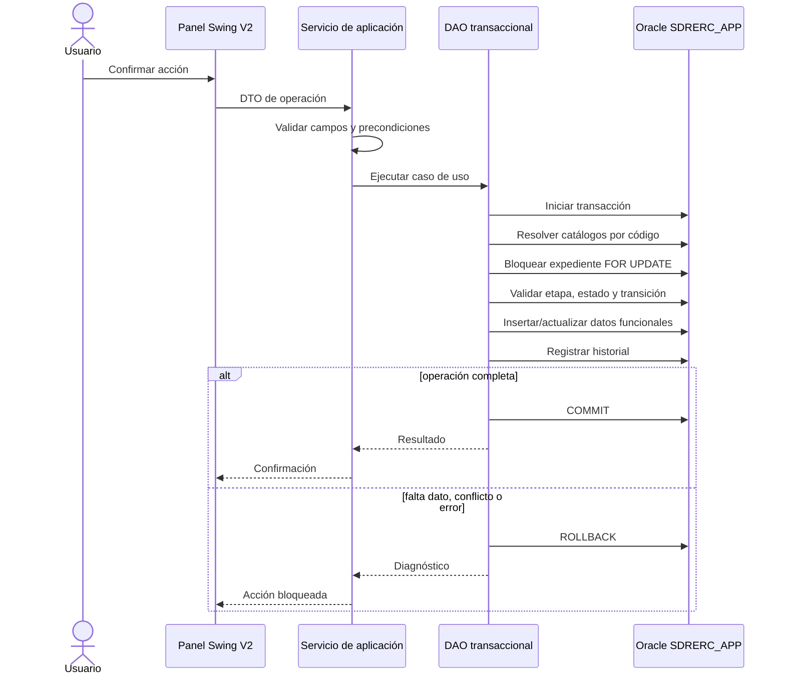
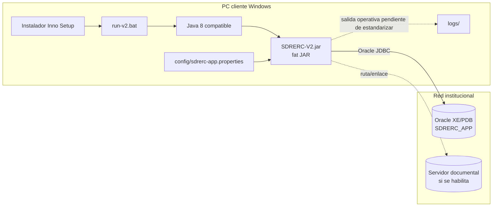

# Diseño de arquitectura de software - SDRERC V2

## Control del documento

| Campo | Valor |
|---|---|
| Sistema | Sistema de Gestión de Expedientes SDRERC |
| Componente | Aplicación SDRERC V2 |
| Versión documental | 1.1 |
| Fecha de línea base | 12/06/2026 |
| Estado | Línea base para revisión de Ingeniería de Software, Infraestructura y Soporte Tecnológico |
| Tecnología principal | Java 8, Swing, FlatLaf, JDBC, Oracle |
| Artefacto desplegable | `SDRERC-V2.jar` |
| Punto de entrada | `com.sdrerc.appv2.MainV2` |
| Esquema de datos V2 | `SDRERC_APP` |

## 1. Propósito

Este documento define la arquitectura vigente y objetivo de SDRERC V2 para:

- sustentar la revisión técnica institucional;
- delimitar la separación entre SDRERC V2 y la aplicación legacy;
- describir componentes, responsabilidades, dependencias y despliegue;
- documentar los mecanismos de consulta y escritura controlada;
- registrar restricciones, decisiones, riesgos y brechas;
- servir de base para seguridad, disponibilidad, continuidad, pruebas y operación.

No reemplaza el diseño de datos, el manual de instalación, el plan de pruebas, el documento de seguridad ni los procedimientos de continuidad y recuperación ante desastres.

## 2. Alcance

Incluye:

- aplicación de escritorio SDRERC V2;
- módulos operativos y administrativos V2;
- acceso JDBC al esquema Oracle `SDRERC_APP`;
- flujo configurable `SDRERC_TO_BE`;
- empaquetado Maven, despliegue LAN e instalador;
- relación controlada con componentes legacy que permanecen en el repositorio.

No incluye como capacidad implementada:

- integraciones automáticas con OAD, SIO, SIRCM, SITD, Mesa de Partes Virtual u otros sistemas;
- envío real de correo, SMS, WhatsApp o notificaciones externas;
- publicación automática en portales;
- movimiento físico de archivos a NAS, SharePoint, Drive o repositorios documentales;
- alta disponibilidad o recuperación ante desastres ya configuradas;
- reemplazo o eliminación de la aplicación legacy.

## 3. Fuentes de arquitectura

La línea base fue elaborada mediante revisión estática de:

| Fuente | Uso |
|---|---|
| `AGENTS.md` | Reglas persistentes, restricciones, módulos y decisiones vigentes |
| `docs/arquitectura_bd/TO BE V2.bpmn` | Actores, tareas, decisiones y flujo funcional objetivo |
| `docs/arquitectura_bd/Acta_Reunión_011-2026-DRC.md` | Primera revisión funcional del 06/05/2026 |
| `docs/arquitectura_bd/Acta_Reunión_012-2026-DRC.md` | Segunda revisión y adecuaciones del 14/05/2026 |
| `docs/arquitectura_bd/Acta_Reunión_013-2026-DRC.md` | Consolidación del flujo revisado el 22/05/2026 |
| `docs/arquitectura_bd/Acta_Reunion_013_2026_DRC.docx` | Fuente original equivalente al Acta 013 en Markdown |
| `docs/arquitectura_app/INFORME_REESTRUCTURACION_APP_SDRERC.md` | Diagnóstico y estrategia de migración paralela |
| `src/main/java` | Arquitectura implementada, componentes y comportamiento |
| `db/sdrerc_app/scripts` | Modelo físico, flujo, vistas y validaciones |
| `pom.xml` | Plataforma, dependencias y empaquetado |
| `deploy/` | Estructura de distribución LAN e instalador |

La base Oracle no fue consultada ni se ejecutó SQL para elaborar este documento. El estado físico se infiere de scripts y código fuente y debe contrastarse con el diccionario de datos del ambiente correspondiente.

### 3.1 Precedencia y evolución de acuerdos

Las actas representan decisiones incrementales. Ante contradicción se aplica el acuerdo más reciente:

| Tema | Evolución | Criterio vigente |
|---|---|---|
| Duplicidad | Acta 011 propone acta + DNI; Acta 012 define acta + nombre del titular | Número de acta + titular normalizado |
| Momento de numeración | Acta 011 propone Análisis; Acta 012 dispone numeración durante carga | Numeración en Registro, excepto duplicados potenciales, que no reciben número ni consumen correlativo |
| Asignación en Ejecución | Acta 012 menciona asignación masiva en Ejecución | Acta 013 elimina la nueva asignación y conserva al abogado inicial |
| Asignación en Notificación | Acta 012 solicita selección múltiple | No existe una definición posterior suficiente; queda como decisión funcional pendiente |
| Estado “En abandono” | Acta 012 lo menciona en Notificación | Acta 013 lo consolida como resultado de Análisis con derivación directa a Notificación |
| Archivo por no corresponde | Acta 012 ubica una acción en Verificación | Acta 013 permite al abogado archivar o derivar desde Análisis cuando el flujo activo lo soporte |
| Expediente digital | Actas 012 y 013 dejan pendiente una asignación específica | No se exige nueva asignación por defecto; se conserva responsable/custodio |

Los requisitos no reemplazados de las actas 011 y 012 continúan como parte del alcance objetivo.

## 4. Resumen ejecutivo

SDRERC V2 es una aplicación de escritorio modular para gestión de expedientes registrales. Mantiene Java 8 y Swing, incorpora una interfaz tipo consola de casos y accede al esquema independiente `SDRERC_APP` mediante JDBC.

La solución aplica una arquitectura por capas:

1. Presentación Swing V2.
2. Servicios de aplicación y validación.
3. DTOs y modelos de intercambio.
4. DAOs JDBC especializados.
5. Conexión externa a Oracle.
6. Esquema normalizado, vistas de consulta, flujo configurable e historial.

La coexistencia con la aplicación legacy es deliberada. V2 dispone de su propio punto de entrada, paquetes, conexión y artefacto, mientras el código legacy permanece sin ser reemplazado.

La escritura V2 está habilitada únicamente en operaciones expresamente autorizadas y se implementa mediante servicios/DAOs transaccionales, validación del estado actual, resolución de catálogos por código, bloqueo pesimista de expedientes y registro de historial.

## 5. Principios arquitectónicos

1. **Separación de legacy:** V2 no modifica la conexión global ni los puntos de entrada legacy.
2. **Arquitectura por capas:** la UI no contiene SQL operativo.
3. **Códigos sobre IDs:** etapas, estados, movimientos y catálogos se resuelven por código.
4. **Lectura primero:** las consultas usan DAOs y vistas; la escritura se habilita por caso de uso.
5. **Transacción completa:** cada movimiento funcional debe confirmar o revertir como unidad.
6. **Trazabilidad obligatoria:** los cambios de flujo registran historial.
7. **Sin borrado físico funcional:** se emplean flags de actividad, cierre o archivo.
8. **Flujo configurable:** las acciones válidas provienen de `FLUJO_TRANSICION`.
9. **Interfaz orientada al caso:** bandejas, consola única, etapas, badges, contexto y acciones.
10. **Recursos locales:** imágenes e iconos se empaquetan con la aplicación.
11. **Sin etapa visual VALIDACION:** las validaciones son reglas, acciones, evaluaciones u observaciones.

## 6. Contexto del sistema



Los actores externos no poseen login, rol, equipo ni bandeja interna. Se representan como personas, remitentes, solicitantes, entidades de origen/destino o referencias documentales.

## 7. Arquitectura lógica



## 8. Capas y responsabilidades

| Capa | Paquetes principales | Responsabilidad |
|---|---|---|
| Arranque | `com.sdrerc.appv2` | Instalar configuración visual e iniciar V2 en el EDT de Swing |
| Shell visual | `com.sdrerc.ui.appv2` | Ventana principal, navegación, home y tema |
| Componentes UI | `com.sdrerc.ui.appv2.components` | Tablas, toolbars, paneles laterales, badges, cards y fecha premium |
| Módulos | `com.sdrerc.ui.views.*` | Bandejas y acciones por macroetapa |
| Aplicación | `com.sdrerc.application.sdrercapp` | Casos de uso, orquestación, validaciones y políticas funcionales |
| Contratos | `com.sdrerc.domain.dto.sdrercapp` | Transferencia tipada de datos entre DAO, servicio y UI |
| Acceso a datos | `com.sdrerc.infrastructure.sdrercapp.dao` | SQL JDBC, mapeo, concurrencia y transacciones |
| Conectividad | `com.sdrerc.infrastructure.database.SdrercAppConnection` | Resolución de configuración y creación de conexiones Oracle |
| Seguridad | `com.sdrerc.infrastructure.security` | Hash BCrypt, generación y política de contraseñas |
| Sesión | `com.sdrerc.shared.session.SessionContext` | Usuario autenticado y contexto de ejecución |
| Datos | `SDRERC_APP` | Persistencia, integridad, flujo, trazabilidad y vistas |

## 9. Módulos funcionales V2

| Grupo | Módulo | Responsabilidad principal |
|---|---|---|
| Portada | Inicio | Métricas, accesos y visualización del flujo |
| Consulta | Bandeja de Expedientes | Búsqueda transversal y apertura de la consola única |
| Operación | Registro / Recepción | Carga diaria, previsualización y registro manual |
| Operación | Asignación | Asignar abogado/equipo y asociar duplicados confirmados |
| Operación | Análisis | Evaluación, observaciones y documentos analizados |
| Operación | Verificación | Aprobar, observar, revertir documentos o devolver a análisis |
| Operación | Firma / Emisión | Firma, resolución, numeración y envío a ejecución |
| Operación | Ejecución | Registro de ejecución, observaciones y reversión controlada |
| Comunicación | Notificación | Intentos, cargo, resultado, publicación requerida y cierre |
| Comunicación | Publicación | Registro de publicación y cierre posterior |
| Custodia | Expediente digital | Carpeta, ruta, enlace, custodio y completitud |
| Finalización | Cierre / Archivo | Cierre, archivo y consulta de antecedentes |
| Administración | Usuarios | Alta, modificación y activación/inactivación |
| Administración | Equipo Jurídico | Equipos, miembros y supervisor |
| Administración | Roles | Roles y permisos |

La consola `DlgConsolaExpedienteV2` es el detalle único compartido. No deben crearse consolas paralelas por módulo.

Requisitos transversales derivados de las primeras revisiones:

- Registro / Recepción debe admitir dos titulares para actas de matrimonio.
- La carga diaria es interoperabilidad por archivo Excel proveniente del proceso SITD; no constituye integración directa.
- Las bandejas deben evolucionar a paginación real en Service/DAO. El control “Mostrar” limita resultados, pero no es paginación.
- Los módulos requieren exportación Excel por etapa con una matriz de columnas aprobada.
- Los plazos deben ser configurables por tipo documental o etapa.
- Las descripciones breves por tipo documental deben provenir de catálogo mantenible.
- La actualización masiva de Ejecución y Notificación queda pendiente de la matriz funcional correspondiente.
- La opción “Asignación de respuesta” permanece sin definición funcional y no autoriza nuevos objetos o módulos.

### 9.1 Trazabilidad de requisitos de las actas

| Acta | Requisito | Estado observado al 12/06/2026 |
|---|---|---|
| 011 | Datos mínimos en Recepción y datos de notificación no obligatorios | Alineado con la separación funcional de Registro y Notificación |
| 011 | Dos titulares para actas de matrimonio | Pendiente de cobertura V2 de extremo a extremo |
| 011 | Carga diaria mediante Excel originado en SITD | Implementada como importación XLSX; sin integración directa |
| 011 | Número y estado de documentos generados | Modelado e incorporado en módulos operativos |
| 011 | Reportes Excel por etapa | Parcial/no uniforme |
| 011 | Descripciones breves por tipo documental | Pendiente de catálogo mantenible |
| 011 | Plazo máximo configurable por tipo documental | Modelo disponible; integración de Registro pendiente |
| 012 | Tipos de identidad para remitente y titular | Implementado mediante catálogos/reglas V2, con política vigente específica para RUC |
| 012 | Duplicados informativos y no restrictivos | Implementado; se guardan sin número hasta confirmación |
| 012 | Asignación múltiple | Implementada en Asignación; anulada en Ejecución; pendiente en Notificación |
| 012 | Paginación de listas y bandejas | Pendiente; existe limitación de cantidad |
| 012 | Actualización masiva de Ejecución/Notificación | Pendiente de matriz y autorización |
| 013 | Mismo abogado para Análisis y Ejecución | Modelado e implementado como regla vigente |
| 013 | Resultados especiales hacia Notificación | Modelado en evaluación y flujo |
| 013 | Verificación, reversión y número de resolución | Implementado mediante servicios/DAOs controlados |
| 013 | Un intento virtual, dos presenciales y publicación | Modelado e implementado en flujo controlado |
| 013 | Expediente digital sin asignación obligatoria | Modelado e implementado como metadata/custodia |

## 10. Flujo funcional de alto nivel



Las transiciones reales deben existir y estar activas en `FLUJO_TRANSICION`. La UI no debe inventar una acción, etapa o estado ausente del modelo.

## 11. Patrón de consulta



Características:

- consultas parametrizadas con `PreparedStatement`;
- límites de resultados en bandejas;
- uso de vistas para lectura transversal;
- consultas específicas cuando la vista no contiene el detalle requerido;
- operaciones largas ejecutadas mediante `SwingWorker` en varios módulos para no bloquear el EDT.

## 12. Patrón de escritura controlada



Controles implementados en los DAOs V2:

- `setAutoCommit(false)`, `commit()` y `rollback()`;
- bloqueo `SELECT ... FOR UPDATE` en movimientos sensibles;
- validación de estado actual para prevenir doble procesamiento;
- resolución de IDs por códigos de catálogo;
- verificación de transición activa;
- registro de `EXPEDIENTE_HISTORIAL`;
- desactivación lógica en administración.

## 13. Gestión de duplicados y correlativo

La duplicidad en Registro / Recepción se determina por la combinación normalizada:

```text
número de acta + titular
```

El registro duplicado:

- se conserva para trazabilidad;
- queda marcado como potencial duplicado;
- no recibe un nuevo número de expediente;
- no consume correlativo;
- solo se asocia al principal cuando el asignador confirma la relación;
- no se asigna como caso operativo independiente después de la asociación.

El número visible sigue el formato:

```text
SDRERC-EXP-YYYY-000001
```

La estrategia actual calcula el máximo correlativo existente para el año. Debe reforzarse para concurrencia antes de operación multiusuario intensiva, según el riesgo ARQ-R04.

## 14. Seguridad arquitectónica

### 14.1 Controles existentes

- contraseñas de usuario almacenadas como hash BCrypt;
- política de contraseña temporal con longitud y complejidad;
- tablas de usuarios, roles, permisos, equipos y supervisión;
- configuración de conexión V2 externalizada;
- SQL parametrizado en DAOs;
- acciones de flujo configuradas en base de datos;
- desactivación lógica en lugar de borrado físico;
- separación entre historial funcional y auditoría técnica.

### 14.2 Estado parcial o pendiente

| Control | Estado observado |
|---|---|
| Autenticación de entrada V2 | Pendiente de integración explícita: `MainV2` abre el menú directamente |
| Autorización de menú por rol/permiso | Parcial: existen catálogos y servicios, pero el menú V2 no filtra accesos |
| Autorización central por caso de uso | Parcial: hay validaciones distribuidas en servicios/DAOs |
| Protección del password de BD en cliente | Pendiente: properties/env siguen siendo secretos recuperables por el equipo |
| Cifrado JDBC en tránsito | No confirmado |
| Gestión centralizada de secretos | No implementada |
| Bloqueo de cuenta, expiración y reintentos | No confirmado |
| Registro de sesión y cierre seguro | Parcial |
| Auditoría técnica automática | Modelo existente; cobertura efectiva debe validarse |

### 14.3 Reglas obligatorias

- no documentar ni versionar contraseñas reales;
- usar un usuario Oracle de mínimo privilegio;
- restringir lectura del archivo de configuración mediante permisos del sistema operativo;
- no usar `SYSTEM` como usuario de la aplicación;
- no exponer mensajes SQL sensibles al usuario final;
- validar rol, permiso, alcance y transición también en la capa de aplicación/DAO.

## 15. Configuración

Orden de resolución observado para la conexión:

1. propiedades del sistema Java;
2. variables de entorno;
3. archivo externo `config/sdrerc-app.properties`.

Variables soportadas:

```text
SDRERC_APP_DB_URL
SDRERC_APP_DB_USER
SDRERC_APP_DB_PASSWORD
SDRERC_APP_CONFIG
```

No deben incluirse valores reales en documentación, repositorio, instalador ni ejemplos distribuidos.

## 16. Despliegue



### 16.1 Estructura de distribución

```text
deploy/SDRERC-V2/
  SDRERC-V2.jar
  run-v2.bat
  config/
    sdrerc-app.properties.example
  lib/
  logs/
```

### 16.2 Construcción

Maven genera un JAR autocontenido mediante `maven-shade-plugin`. El manifest apunta a `com.sdrerc.appv2.MainV2`.

Dependencias principales:

| Dependencia | Uso |
|---|---|
| Oracle JDBC `ojdbc8` | Acceso a Oracle |
| FlatLaf | Look and feel |
| FlatLaf Extras/Themes | Temas y SVG |
| Apache POI | Importación y generación XLSX |
| JCalendar | Calendario |
| BCrypt | Hash de contraseñas |
| Log4j 2 | Dependencia de logging, aún sin configuración operativa central observada |

## 17. Disponibilidad y operación

La arquitectura desplegada es cliente-servidor de dos niveles:

- múltiples clientes de escritorio;
- una base Oracle central;
- opcionalmente un servidor de archivos referenciado.

No se observó configuración implementada de:

- clúster o réplica de base de datos;
- balanceo;
- pool de conexiones;
- reintentos controlados o circuit breaker;
- monitoreo de salud;
- telemetría central;
- respaldo, restauración, RPO o RTO;
- procedimiento formal de continuidad.

Estas capacidades deben definirse con Infraestructura. Hasta entonces, Oracle y la red LAN son puntos únicos de falla.

## 18. Atributos de calidad

| Atributo | Decisión o mecanismo |
|---|---|
| Mantenibilidad | Capas separadas, DTOs, servicios y DAOs por módulo |
| Integridad | PK/FK/constraints, transacciones y validación de transición |
| Trazabilidad | Historial funcional y modelo de auditoría técnica |
| Usabilidad | Consola única, nombres amigables, badges y componentes reutilizables |
| Compatibilidad | Java 8, JAR ejecutable, rutas relativas y despliegue LAN |
| Seguridad | BCrypt, RBAC modelado, configuración externa y mínimo privilegio objetivo |
| Rendimiento | Índices, límites de bandeja y consultas específicas; paginación real pendiente |
| Concurrencia | Bloqueo `FOR UPDATE` y validación de estado |
| Evolución | Flujo y catálogos configurables por código |
| Interoperabilidad | JDBC y archivos XLSX; integraciones externas aún no implementadas |

## 19. Decisiones de arquitectura

| ID | Decisión | Justificación |
|---|---|---|
| ADR-01 | Mantener V2 paralela al legacy | Reduce riesgo de regresión y permite migración gradual |
| ADR-02 | Mantener Java 8 y Swing | Compatibilidad con el entorno y la base instalada |
| ADR-03 | Usar `SdrercAppConnection` | Evita alterar la conexión global legacy |
| ADR-04 | Acceder a BD mediante DAO/Service | Evita SQL en formularios y centraliza reglas |
| ADR-05 | Resolver flujo por códigos | Elimina dependencia de IDs variables |
| ADR-06 | Usar una consola única | Evita duplicidad funcional y visual |
| ADR-07 | Persistir historial por movimiento | Garantiza trazabilidad de caso |
| ADR-08 | Empaquetar fat JAR | El cliente no depende de Maven ni del IDE |
| ADR-09 | Modelar actores externos fuera de seguridad | No poseen acceso interno al aplicativo |
| ADR-10 | No crear etapa `VALIDACION` | Alineamiento funcional BPMN/SDRERC |

## 20. Estado de implementación

| Capacidad | Estado |
|---|---|
| Punto de entrada V2 independiente | Implementado |
| Menú y home V2 | Implementado |
| Módulos operativos V2 | Implementados o incorporados |
| Módulos administrativos V2 | Implementados |
| Consola única de expediente | Implementada |
| Conexión externa a `SDRERC_APP` | Implementada |
| DAOs y servicios V2 | Implementados |
| Escritura transaccional controlada | Implementada por módulos autorizados |
| Flujo configurable y acciones permitidas | Implementado en modelo y consumo |
| Empaquetado e instalador LAN | Implementado |
| Autenticación V2 integrada al arranque | Pendiente |
| Autorización uniforme de menú y casos de uso | Parcial |
| Dos titulares para actas de matrimonio en V2 | Soportado conceptualmente por el modelo N:M; cobertura UI/persistencia debe verificarse |
| Plazo configurable por tipo documental | Modelo disponible; Registro aún usa un plazo fijo transitorio |
| Paginación real en todas las bandejas | Pendiente; existe límite de cantidad |
| Exportación Excel por etapa | Parcial/no uniforme |
| Actualización masiva Excel en Ejecución/Notificación | Pendiente de matriz y autorización |
| Descripciones preconfiguradas por tipo documental | Pendiente de diseño de catálogo |
| Pruebas automatizadas | No detectadas |
| CI/CD | No detectado |
| Logging operativo central | No detectado |
| Monitoreo y alertas técnicas | No detectado |
| Alta disponibilidad y DR | No definido |
| Integraciones externas | No implementadas |

## 21. Riesgos y brechas

| ID | Riesgo | Nivel | Tratamiento recomendado |
|---|---|---:|---|
| ARQ-R01 | V2 abre el menú sin autenticación explícita | Crítico | Integrar login V2 antes de producción y poblar `SessionContext` |
| ARQ-R02 | Permisos no aplicados uniformemente en navegación y servicios | Alto | Crear guard central de autorización por usuario, rol, permiso y transición |
| ARQ-R03 | Password de BD distribuido en cliente | Alto | Usar cuenta restringida, ACL del SO, rotación y mecanismo institucional de secretos |
| ARQ-R04 | Correlativo calculado con `MAX + 1` | Alto | Usar secuencia/control correlativo transaccional y constraint único |
| ARQ-R05 | Sin pruebas automatizadas ni CI | Alto | Incorporar pruebas de servicios/DAOs y pipeline de compilación/análisis |
| ARQ-R06 | Sin configuración central de logging | Alto | Definir Log4j2, rotación, niveles, ubicación y sanitización |
| ARQ-R07 | Oracle central como punto único de falla | Alto | Definir respaldo, restauración, RPO, RTO y contingencia |
| ARQ-R08 | Conexión JDBC sin pool ni timeouts documentados | Medio | Evaluar pool compatible con Java 8 y configurar timeouts |
| ARQ-R09 | Mensaje visual de “lectura” no refleja escrituras ya habilitadas | Medio | Ajustar indicador de modo según capacidades y permisos |
| ARQ-R10 | Integraciones BPMN representadas solo como gestión manual/metadata | Medio | Mantenerlas como alcance futuro hasta contar con contratos autorizados |
| ARQ-R11 | Mezcla de código legacy y V2 en un mismo artefacto fuente | Medio | Mantener límites de paquetes y evaluar modularización posterior |
| ARQ-R12 | Instalador requiere privilegios administrativos | Medio | Validar modelo de distribución con Soporte y políticas de endpoint |
| ARQ-R13 | Las bandejas limitan filas sin paginación real | Medio | Implementar paginación server-side reutilizable |
| ARQ-R14 | Registro calcula vencimiento con un plazo fijo de 30 días | Alto | Resolver `PLAZO_CONFIGURACION` por tipo documental/etapa |
| ARQ-R15 | Dos titulares de matrimonio no tienen cobertura V2 confirmada de extremo a extremo | Alto | Probar UI, DTO, DAO, consola e importador con dos relaciones TITULAR |
| ARQ-R16 | Reportes y cargas masivas no tienen matrices definitivas | Medio | Aprobar contratos Excel antes de implementar escrituras |
| ARQ-R17 | La asignación específica de Notificación no está definida | Medio | Acordar responsable, bandeja, transición y asignación masiva antes de implementar |

Se detectó además una credencial escrita en texto claro dentro de un script de creación de esquema. No se reproduce en este documento. Debe reemplazarse mediante un cambio SQL autorizado y rotarse si fue utilizada.

## 22. Controles de aceptación arquitectónica

Antes de declarar un pase productivo:

- el arranque debe exigir autenticación;
- cada módulo y acción debe validar permisos;
- el artefacto debe ser `SDRERC-V2.jar`;
- la conexión debe usar `SDRERC_APP`, no `SYSTEM`;
- las credenciales no deben estar versionadas;
- la app legacy debe permanecer intacta;
- cada escritura debe ser transaccional y dejar historial;
- el flujo debe bloquear acciones sin transición activa;
- el correlativo debe ser seguro bajo concurrencia;
- debe existir prueba de compilación, instalación, conexión, rollback y concurrencia;
- deben aprobarse procedimientos de respaldo, restauración y continuidad;
- debe definirse logging operativo sin datos sensibles.

## 23. Trazabilidad funcional

| Requisito o acuerdo | Elemento arquitectónico |
|---|---|
| Abogado único en análisis y ejecución | `EXPEDIENTE.ID_USUARIO_ABOGADO_INICIAL` y asignación principal |
| Duplicados se importan y asocian en Asignación | Registro V2, `EXPEDIENTE_RELACION`, servicio transaccional |
| Dos titulares para acta de matrimonio | Múltiples relaciones `EXPEDIENTE_PERSONA` con tipo `TITULAR` |
| Carga diaria originada en SITD | Importación XLSX controlada, sin integración directa |
| Plazo máximo por tipo documental | `PLAZO_CONFIGURACION` y fecha de vencimiento |
| Reportes Excel por etapa | Servicios de exportación pendientes de matriz aprobada |
| Paginación en listas y bandejas | Requisito transversal pendiente de implementación real |
| Sin etapa visual VALIDACION | Macroetapas y acciones configuradas |
| 1 notificación virtual + 2 presenciales | Servicio/DAO de Notificación y constraints del modelo |
| Publicación posterior a notificación fallida | Módulo Publicación y transición configurada |
| Expediente digital sin asignación obligatoria | Metadata en `EXPEDIENTE_DIGITAL` |
| Trazabilidad completa | `EXPEDIENTE_HISTORIAL` |
| Auditoría técnica separada | `AUDITORIA_EVENTO` |
| Consola de seguimiento | `DlgConsolaExpedienteV2` y vistas de consola |
| Despliegue LAN independiente del IDE | Maven Shade, launcher e instalador |

## 24. Próximas decisiones institucionales

Requieren validación de las áreas competentes:

1. mecanismo de autenticación y posible integración con directorio institucional;
2. matriz final de roles, permisos y segregación de funciones;
3. cifrado de conexión Oracle y gestión de secretos;
4. topología productiva de Oracle y servidor documental;
5. RPO, RTO, respaldos, restauración y contingencia;
6. política de logs, monitoreo y mesa de ayuda;
7. retención y clasificación de documentos y datos personales;
8. contratos de integración con sistemas externos;
9. estrategia de pruebas, CI/CD y control de versiones de base de datos;
10. retiro o convivencia de largo plazo con la aplicación legacy.
11. matrices de exportación e importación Excel para cada etapa;
12. definición de “Asignación de respuesta”;
13. responsabilidad final sobre estados de documentos y descripciones preconfiguradas.
14. necesidad y reglas de asignación específica o masiva en Notificación.
