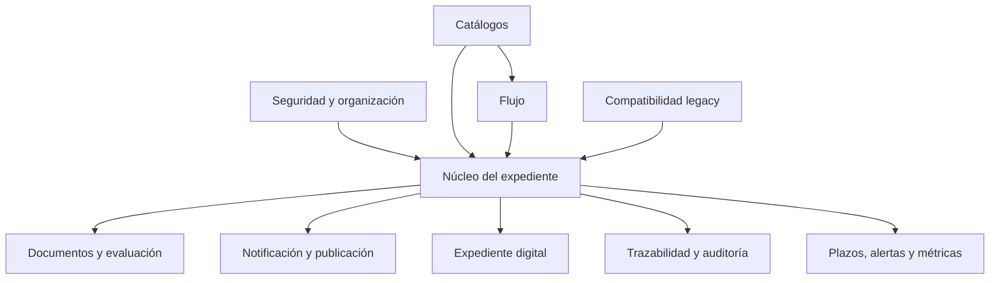
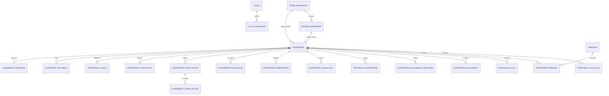
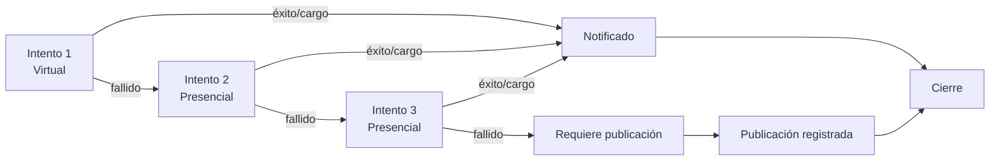

# Diseño de datos - SDRERC_APP

## Control del documento

| Campo | Valor |
|---|---|
| Sistema | Sistema de Gestión de Expedientes SDRERC |
| Modelo | Esquema Oracle `SDRERC_APP` |
| Versión documental | 1.0 |
| Fecha de línea base | 12/06/2026 |
| Estado | Línea base lógica y física para revisión |
| Motor objetivo | Oracle XE / Oracle compatible con JDBC 8 |
| Fuentes | Scripts `01` a `20`, DAOs V2, BPMN TO BE V2, Acta 013-2026-DRC y `AGENTS.md` |

## 1. Propósito

Este documento describe el diseño conceptual, lógico y físico del esquema `SDRERC_APP`, incluyendo:

- dominios de información;
- entidades y relaciones;
- reglas de integridad;
- modelo de flujo;
- trazabilidad y auditoría;
- vistas de consulta;
- índices;
- reglas de duplicidad y correlativo;
- clasificación, calidad, migración y riesgos.

No se ejecutó SQL ni se consultó el diccionario de una base Oracle. El documento representa el modelo definido en los scripts y consumido por el código al 12/06/2026. La existencia y versión de cada objeto debe verificarse en el ambiente antes de una aprobación física definitiva.

## 2. Objetivos del modelo

1. Separar `SDRERC_APP` del esquema legacy.
2. Evitar el uso de `SYSTEM` como propietario de datos funcionales.
3. Normalizar expedientes, personas, solicitudes, actas y documentos.
4. Modelar etapas, estados y transiciones configurables.
5. Conservar responsable actual y abogado principal.
6. Registrar historial funcional completo.
7. Mantener auditoría técnica separada.
8. Soportar notificación, cargos, publicación y expediente digital.
9. Conservar duplicados para trazabilidad sin consumir correlativo.
10. Facilitar bandejas, búsqueda y consola de expediente.

## 3. Principios de datos

- Toda entidad persistente posee clave primaria.
- Las relaciones funcionales principales usan claves foráneas.
- Los catálogos críticos poseen `CODIGO` y `NOMBRE`.
- Los IDs se resuelven por código desde la aplicación.
- Las tablas operativas emplean baja lógica mediante `ACTIVO`.
- Los cambios de flujo deben registrar `EXPEDIENTE_HISTORIAL`.
- La auditoría técnica se registra en `AUDITORIA_EVENTO`.
- No se eliminan físicamente expedientes, documentos ni relaciones funcionales.
- Los actores externos se modelan fuera de `USUARIO`.
- No existe una etapa visual `VALIDACION`.
- `ESTADO_EXPEDIENTE.CODIGO` es único globalmente.

## 4. Dominios de información



## 5. Modelo conceptual

El agregado central es `EXPEDIENTE`. Un expediente:

- tiene una etapa y estado actual;
- puede tener solicitud, personas y actas;
- puede contener documentos;
- puede relacionarse con otros expedientes;
- puede asignarse a un abogado y equipo;
- puede registrar evaluaciones y observaciones;
- puede generar resolución;
- puede tener hasta tres intentos estándar de notificación;
- puede recibir cargos y requerir publicación;
- puede referenciar una carpeta digital;
- conserva un historial de movimientos.



## 6. Inventario de entidades

### 6.1 Seguridad y organización

| Tabla | Propósito | Claves o atributos relevantes |
|---|---|---|
| `AREA` | Unidad organizacional interna | `ID_AREA`, `CODIGO`, `NOMBRE` |
| `ROL` | Perfil funcional | `ID_ROL`, `CODIGO`, `NOMBRE` |
| `USUARIO` | Usuario interno del aplicativo | `USERNAME`, `PASSWORD_HASH`, `ESTADO`, `ACTIVO` |
| `USUARIO_ROL` | Asociación usuario-rol | `ID_USUARIO`, `ID_ROL`, `ACTIVO` |
| `EQUIPO` | Equipo operativo o jurídico | `ID_AREA`, `CODIGO`, `NOMBRE` |
| `EQUIPO_USUARIO` | Miembro o responsable de equipo | `ID_EQUIPO`, `ID_USUARIO`, `ES_RESPONSABLE` |
| `USUARIO_SUPERVISION` | Relación supervisor-abogado | `ID_SUPERVISOR`, `ID_ABOGADO` |
| `PERMISO` | Acción autorizable por módulo | `CODIGO`, `NOMBRE`, `MODULO` |
| `ROL_PERMISO` | Asociación rol-permiso | `ID_ROL`, `ID_PERMISO` |

Solo los actores internos se registran como usuarios. Ciudadano/Entidad, OGD, SDPRC, municipalidades y similares se modelan como personas o entidades externas.

### 6.2 Entidades externas y recepción

| Tabla | Propósito | Claves o atributos relevantes |
|---|---|---|
| `ENTIDAD_EXTERNA` | Organismo o actor sin acceso interno | `CODIGO`, `NOMBRE`, `TIPO_ENTIDAD` |
| `CANAL_RECEPCION` | Canal de ingreso | `CODIGO`, `NOMBRE` |

### 6.3 Catálogos críticos

| Tabla | Dominio |
|---|---|
| `ETAPA_EXPEDIENTE` | Macroetapas visibles |
| `ESTADO_EXPEDIENTE` | Estados vinculados a una etapa |
| `TIPO_MOVIMIENTO` | Eventos funcionales del historial |
| `TIPO_DOCUMENTO` | Tipo funcional de documento o solicitud |
| `TIPO_ACTA` | Tipo de acta registral |
| `PROCEDIMIENTO_REGISTRAL` | Procedimiento aplicable |
| `TIPO_DOCUMENTO_ADJUNTO` | Clasificación de documentos adjuntos |
| `ESTADO_DOCUMENTO` | En proyecto, despacho, emitido u otros |
| `TIPO_OBSERVACION` | Clasificación de observaciones |
| `TIPO_RESULTADO_EVALUACION` | Resultado de análisis |
| `TIPO_RESULTADO_EJECUCION` | Resultado de ejecución |
| `TIPO_NOTIFICACION` | Virtual, presencial u otras modalidades |
| `ESTADO_NOTIFICACION` | Estado del intento |
| `ESTADO_CARGO_ACUSE` | Estado del cargo |
| `TIPO_RESOLUCION` | Clasificación resolutiva |
| `MOTIVO_NO_CORRESPONDE` | Motivo de no atención |
| `MOTIVO_ARCHIVO` | Motivo de archivo |
| `MOTIVO_CORRECCION` | Motivo de corrección |

### 6.4 Flujo

| Tabla | Propósito |
|---|---|
| `FLUJO` | Identifica el flujo y su versión |
| `FLUJO_TRANSICION` | Define origen, destino, acción y requisitos |
| `FLUJO_TRANSICION_ROL` | Autoriza transiciones por rol |
| `FLUJO_TRANSICION_EQUIPO` | Autoriza transiciones por equipo |

El flujo vigente se identifica por el código `SDRERC_TO_BE`.

### 6.5 Núcleo del expediente

| Tabla | Propósito | Datos principales |
|---|---|---|
| `EXPEDIENTE` | Cabecera y estado actual | número, trámite, etapa, estado, responsables, fechas, flags |
| `EXPEDIENTE_SOLICITUD` | Datos de ingreso | entidad, canal, solicitante, recepción, asunto, duplicidad |
| `PERSONA` | Persona natural o jurídica | documento, nombres, razón social, contacto |
| `EXPEDIENTE_PERSONA` | Rol de la persona en el caso | titular, remitente, solicitante u otro |
| `EXPEDIENTE_ACTA` | Acta vinculada | tipo, número, año, oficina, libro y folio |
| `EXPEDIENTE_RELACION` | Relación entre casos | principal, relacionado, tipo y descripción |
| `EXPEDIENTE_ASIGNACION` | Historial de asignaciones | abogado, equipo, etapa, vigencia y motivo |

### 6.6 Documentos, análisis y resolución

| Tabla | Propósito |
|---|---|
| `EXPEDIENTE_DOCUMENTO` | Metadata de documentos del expediente |
| `EXPEDIENTE_DOCUMENTO_ANALIZADO` | Documentos evaluados durante análisis/ejecución |
| `EXPEDIENTE_EVALUACION` | Corresponde, incorporado, resultado y fundamento |
| `EXPEDIENTE_OBSERVACION` | Observaciones y subsanación |
| `EXPEDIENTE_RESOLUCION` | Número, fecha, firma y documento resolutivo |

### 6.7 Notificación, publicación y custodia

| Tabla | Propósito |
|---|---|
| `EXPEDIENTE_NOTIFICACION` | Intento, modalidad, estado, resultado y publicación requerida |
| `EXPEDIENTE_CARGO_ACUSE` | Evidencia de recepción asociada a un intento |
| `EXPEDIENTE_PUBLICACION` | Generación y registro de publicación |
| `EXPEDIENTE_DIGITAL` | Código, ruta, enlace, responsable, custodio y completitud |
| `EXPEDIENTE_DERIVACION_EXTERNA` | Oficio, entidad destino y respuesta externa |

### 6.8 Plazos, alertas y métricas

| Tabla | Propósito |
|---|---|
| `PLAZO_CONFIGURACION` | Plazo por etapa o tipo documental |
| `EXPEDIENTE_PLAZO` | Vigencia calculada de un caso |
| `EXPEDIENTE_ALERTA` | Alertas funcionales |
| `EXPEDIENTE_METRICA_ETAPA` | Entrada, salida y permanencia por etapa |

### 6.9 Trazabilidad, auditoría y transición legacy

| Tabla | Propósito |
|---|---|
| `EXPEDIENTE_HISTORIAL` | Trazabilidad funcional del caso |
| `AUDITORIA_EVENTO` | Auditoría técnica de cambios |
| `LEGACY_ESTADO_MAP` | Equivalencia de estados legacy |
| `LEGACY_CATALOGO_MAP` | Equivalencia de catálogos legacy |

## 7. Cabecera EXPEDIENTE

`EXPEDIENTE` concentra únicamente los datos necesarios para identificar y ubicar el caso:

| Grupo | Columnas |
|---|---|
| Identificación | `ID_EXPEDIENTE`, `NUMERO_EXPEDIENTE`, `NUMERO_TRAMITE_DOCUMENTARIO` |
| Flujo actual | `ID_ETAPA_ACTUAL`, `ID_ESTADO_ACTUAL` |
| Responsabilidad | `ID_USUARIO_RESPONSABLE_ACTUAL`, `ID_USUARIO_ABOGADO_INICIAL`, `ID_EQUIPO_RESPONSABLE_ACTUAL` |
| Fechas | `FECHA_REGISTRO`, `FECHA_ULTIMO_MOVIMIENTO`, `FECHA_VENCIMIENTO` |
| Indicadores | `PRIORIDAD`, `REQUIERE_PUBLICACION`, `EXPEDIENTE_DIGITAL_COMPLETO` |
| Finalización | `ARCHIVADO`, `CERRADO`, `ACTIVO` |
| Compatibilidad | `ID_LEGACY` |
| Auditoría de fila | `CREADO_POR`, `CREADO_EN`, `MODIFICADO_POR`, `MODIFICADO_EN` |

Los detalles de personas, actas, solicitudes, documentos, notificación y publicación no deben volver a incorporarse como columnas masivas de esta tabla.

## 8. Etapas y estados

Macroetapas:

1. Registro.
2. Asignación.
3. Análisis.
4. Verificación.
5. Firma / Emisión.
6. Ejecución.
7. Notificación.
8. Publicación.
9. Expediente digital.
10. Cierre / Archivo.

`VALIDACION` no es una etapa. Las validaciones se representan mediante:

- transiciones;
- movimientos;
- evaluaciones;
- observaciones;
- checks;
- validaciones en servicios y DAOs.

Cada estado pertenece a una etapa mediante `ESTADO_EXPEDIENTE.ID_ETAPA`. El código de estado es único globalmente, por lo que un mismo código no debe duplicarse para dos etapas.

## 9. Transiciones y acciones

`FLUJO_TRANSICION` registra:

- flujo;
- etapa/estado de origen;
- etapa/estado de destino;
- código y nombre de acción;
- requisito de comentario;
- requisito de documento;
- vigencia.

Acciones relevantes identificadas:

| Área | Acciones |
|---|---|
| Registro/Asignación | `RECEPCION_DOCUMENTO`, `IMPORTACION_CARGA_DIARIA`, `ASIGNACION_ABOGADO` |
| Análisis | `REGISTRO_RESULTADO_ANALISIS`, `ENVIO_VERIFICACION`, `CORRECCION_DOCUMENTO`, `REENVIO_VERIFICACION` |
| Verificación | `REGISTRO_OBSERVACION_VERIFICACION`, `REVERSION_ESTADO_DOCUMENTO`, `DEVOLUCION_A_ANALISIS`, `APROBACION_VERIFICACION`, `ENVIO_FIRMA` |
| Firma | `FIRMA_DOCUMENTO`, `REGISTRO_NUMERO_RESOLUCION` |
| Ejecución | `INICIO_EJECUCION`, `OBSERVACION_EJECUCION`, `REVERSION_ESTADO_DOCUMENTO_EJECUCION`, `DEVOLUCION_A_ANALISIS`, `DERIVACION_A_NOTIFICACION` |
| Notificación | `NOTIFICACION_VIRTUAL`, `NOTIFICACION_PRESENCIAL_1`, `NOTIFICACION_PRESENCIAL_2`, `RECEPCION_CARGO_ACUSE`, `CONFIRMACION_NOTIFICACION`, `REGISTRO_NOTIFICACION_FALLIDA`, `GENERACION_PUBLICACION`, `CIERRE` |
| Publicación | `REGISTRO_PUBLICACION`, `CIERRE` |
| Digital | `CREACION_CARPETA_EXPEDIENTE_DIGITAL`, `CARGA_DOCUMENTOS_EXPEDIENTE_DIGITAL` |
| Cierre | `CIERRE`, `ARCHIVO` |

La aplicación debe bloquear cualquier operación si falta la transición activa requerida.

## 10. Relaciones principales

| Relación | Cardinalidad | Regla |
|---|---|---|
| Etapa - Estado | 1:N | Un estado pertenece a una macroetapa |
| Expediente - Solicitud | 1:N | Permite más de un ingreso o antecedente |
| Expediente - Persona | N:M | Resuelta por `EXPEDIENTE_PERSONA` |
| Expediente - Acta | 1:N | Soporta actas o referencias asociadas |
| Expediente - Documento | 1:N | Metadata documental |
| Expediente - Asignación | 1:N | Conserva historial; solo una activa esperada |
| Expediente - Evaluación | 1:N | Conserva resultados y fundamentos |
| Expediente - Resolución | 1:N | Permite evolución o documentos resolutivos |
| Expediente - Notificación | 1:N | Intentos sucesivos |
| Notificación - Cargo | 1:N | Evidencias de recepción |
| Expediente - Publicación | 1:N | Registros de publicación |
| Expediente - Digital | 1:0..1 esperado | Una ficha activa por expediente |
| Expediente - Historial | 1:N | Un evento por movimiento funcional |
| Expediente - Expediente | N:M dirigida | Resuelta por `EXPEDIENTE_RELACION` |

## 11. Duplicados y expedientes asociados

### 11.1 Detección

La única clave funcional de detección en Registro / Recepción es:

```text
UPPER(TRIM(numero_acta)) + UPPER(TRIM(titular_normalizado))
```

No se debe ampliar la condición con trámite, documento, fecha u otros datos sin nueva aprobación funcional.

### 11.2 Persistencia

- El duplicado se inserta como expediente para mantener trazabilidad.
- `EXPEDIENTE_SOLICITUD.POTENCIAL_DUPLICADO` se marca.
- `EXPEDIENTE.NUMERO_EXPEDIENTE` permanece nulo hasta la decisión de Asignación.
- El correlativo no avanza por ese registro.
- La confirmación crea `EXPEDIENTE_RELACION`.
- El relacionado puede heredar el número y vencimiento del principal dentro de la misma transacción.
- El relacionado queda excluido de asignación independiente.

Tipos de relación usados por la aplicación:

```text
MISMA_ACTA_TITULAR
DOCUMENTO_DUPLICADO_ASOCIADO
```

No se fusionan ni eliminan expedientes.

## 12. Numeración de expediente

Formato:

```text
SDRERC-EXP-YYYY-NNNNNN
```

Reglas:

- guiones normales;
- mayúsculas;
- año vigente;
- correlativo de seis dígitos;
- no usar `ID_EXPEDIENTE` como correlativo visible;
- no asignar número a un potencial duplicado;
- avanzar solo cuando se asigna un número real.

Implementación actual:

- consulta el máximo sufijo de seis dígitos para el año;
- acepta temporalmente formato con guion bajo para compatibilidad;
- calcula el siguiente valor dentro de la transacción de registro.

Riesgo: `MAX + 1` sin objeto de serialización ni constraint único puede producir colisiones concurrentes. Se recomienda:

1. crear una entidad de correlativo anual o secuencia controlada;
2. bloquear la fila del año durante la asignación;
3. agregar unique constraint sobre `NUMERO_EXPEDIENTE`;
4. reintentar de forma controlada ante conflicto.

## 13. Asignación y responsabilidad

`EXPEDIENTE_ASIGNACION` conserva:

- usuario asignado;
- equipo;
- etapa;
- fecha de asignación y recepción;
- indicador de asignación activa;
- indicador de abogado principal;
- indicador de reasignación excepcional;
- motivo.

`EXPEDIENTE` mantiene una proyección del responsable actual para consulta rápida.

Regla del Acta 013-2026-DRC:

- análisis y ejecución conservan al mismo abogado principal;
- ejecución no crea una nueva asignación ordinaria;
- una reasignación excepcional debe desactivar la anterior, crear una nueva asignación y registrar historial.

## 14. Evaluación, observación y documentos

`EXPEDIENTE_EVALUACION` modela:

- corresponde/no corresponde;
- motivo de no corresponde;
- acta incorporada;
- reconstitución;
- legitimidad;
- medios probatorios;
- resultado;
- fundamento;
- fecha.

`EXPEDIENTE_OBSERVACION` modela:

- tipo y motivo;
- origen;
- descripción;
- estado de subsanación;
- fecha.

`EXPEDIENTE_DOCUMENTO_ANALIZADO` registra:

- fecha;
- tipo documental;
- descripción;
- estado del documento.

Los estados documentales deben provenir de catálogo, no de texto libre en UI.

## 15. Resolución y firma

`EXPEDIENTE_RESOLUCION` contiene:

- tipo de resolución;
- número;
- fecha de resolución;
- fecha de firma;
- referencia al documento resolutivo.

El número de resolución debe registrarse antes de etapas posteriores cuando la transición lo requiera. El modelo almacena metadata; no implica carga física del archivo.

## 16. Notificación, cargo y publicación



Reglas:

- el número de intento está entre 1 y 3;
- cada intento identifica tipo y estado;
- el cargo referencia el intento correspondiente;
- la publicación se habilita después del fallo conforme a transición activa;
- no se implementa envío o publicación externa desde estas tablas;
- el cierre no elimina información.

## 17. Expediente digital

`EXPEDIENTE_DIGITAL` registra:

- código digital;
- ruta;
- enlace;
- documentos cargados;
- completitud;
- responsable;
- custodio;
- fechas.

El modelo guarda metadata. No mueve archivos físicamente. Por defecto, el abogado principal puede gestionar la carpeta sin crear una asignación independiente.

## 18. Historial funcional

`EXPEDIENTE_HISTORIAL` registra:

- expediente;
- tipo de movimiento;
- fecha;
- etapa y estado de origen;
- etapa y estado de destino;
- usuario y equipo de origen/destino;
- entidad externa de origen/destino;
- tabla e ID relacionados;
- comentario y motivo.

Debe existir un evento para:

- registro;
- asociación de duplicado;
- asignación o reasignación;
- resultado de análisis;
- observación y corrección;
- verificación;
- firma y numeración;
- ejecución y reversión;
- notificación y cargo;
- publicación;
- expediente digital;
- cierre o archivo.

El historial explica el proceso de negocio y no reemplaza la auditoría técnica.

## 19. Auditoría técnica

`AUDITORIA_EVENTO` contempla:

- tabla e ID afectados;
- operación;
- usuario;
- fecha;
- módulo y origen;
- equipo cliente;
- valor anterior y nuevo.

Debe validarse qué operaciones generan actualmente registros, pues el modelo de tabla existe pero no se identificó una cobertura automática completa mediante triggers o una capa transversal.

La auditoría no debe almacenar contraseñas, tokens, archivos completos ni datos innecesarios.

## 20. Integridad física

### 20.1 Restricciones definidas

- PK en todas las tablas inventariadas.
- FK para relaciones funcionales principales.
- UK para códigos de áreas, roles, equipos, catálogos, permisos y flujo.
- UK compuesta para rutas de transición.
- Check de correo obligatorio en trámite virtual.
- Check de evaluación incorporada.
- Check de intento de notificación entre 1 y 3.

### 20.2 Restricciones recomendadas pendientes

| Regla | Recomendación |
|---|---|
| Número de expediente único | UK filtrada por valor no nulo o constraint único Oracle |
| Una asignación activa por expediente | Índice único basado en función o control equivalente |
| Una ficha digital activa por expediente | Constraint/índice único |
| Relación no reflexiva | Check principal distinto de relacionado |
| Relación activa no duplicada | UK lógica por principal, relacionado y tipo |
| Intento único por expediente | UK por expediente y número de intento |
| Usuario-rol activo no duplicado | UK lógica |
| Equipo-usuario activo no duplicado | UK lógica |
| Flags binarios | Checks `IN (0,1)` en todos los indicadores |
| Fecha de vencimiento | Check respecto de fecha de registro cuando aplique |
| Estado coherente con etapa | Validación compuesta o trigger/servicio reforzado |
| FKs del historial | Agregar para etapa, estado, usuario, equipo y entidad si la política de retención lo permite |

## 21. Índices

Índices definidos:

- expediente por número, trámite, etapa, estado, responsable, abogado y último movimiento;
- solicitud por trámite;
- persona por documento;
- acta por número;
- relación por principal;
- asignación por expediente/activa;
- historial por expediente/fecha;
- notificación por expediente/intento;
- cargo por notificación;
- auditoría por tabla/registro;
- derivación, publicación, plazo, alerta y métrica por expediente.

Recomendaciones:

- revisar planes reales de ejecución con volumen representativo;
- indexar también `EXPEDIENTE.FECHA_VENCIMIENTO`;
- evaluar índices compuestos de bandeja por etapa, estado y vencimiento;
- indexar la búsqueda normalizada de acta y titular;
- evitar índices redundantes con constraints únicos;
- recopilar estadísticas después de carga o migración.

## 22. Vistas de lectura

### 22.1 Bandejas

- `VW_EXPEDIENTE_BANDEJA`
- `VW_BANDEJA_REGISTRO`
- `VW_BANDEJA_ASIGNACION`
- `VW_BANDEJA_ABOGADO_ANALISIS`
- `VW_BANDEJA_VERIFICACION`
- `VW_BANDEJA_FIRMA_EMISION`
- `VW_BANDEJA_EJECUCION`
- `VW_BANDEJA_NOTIFICACION`
- `VW_BANDEJA_CARGOS_ACUSE`
- `VW_BANDEJA_PUBLICACION`
- `VW_BANDEJA_EXPEDIENTE_DIGITAL`
- `VW_BANDEJA_CIERRE_ARCHIVO`

### 22.2 Consola

- `VW_EXPEDIENTE_CONSOLA`
- `VW_EXPEDIENTE_TIMELINE`
- `VW_EXPEDIENTE_DOCUMENTOS`
- `VW_EXPEDIENTE_DOCUMENTOS_ANALIZADOS`
- `VW_EXPEDIENTE_PERSONAS`
- `VW_EXPEDIENTE_EVALUACIONES`
- `VW_EXPEDIENTE_RESOLUCIONES`
- `VW_EXPEDIENTE_NOTIFICACIONES`
- `VW_EXPEDIENTE_CARGOS_ACUSE`
- `VW_EXPEDIENTE_PUBLICACION`
- `VW_EXPEDIENTE_DIGITAL`
- `VW_EXPEDIENTE_ACCIONES_PERMITIDAS`

Las vistas son contratos de lectura. Los DAOs pueden consultar tablas cuando requieren un detalle no expuesto, pero la UI nunca debe acceder directamente a SQL.

## 23. Datos personales y clasificación

| Clasificación | Ejemplos | Tratamiento esperado |
|---|---|---|
| Datos personales | nombres, documento, correo, teléfono, dirección | Acceso por rol, minimización y no exposición en logs |
| Datos del expediente | acta, trámite, solicitud, estado | Acceso funcional y trazabilidad |
| Datos sensibles de seguridad | hash de contraseña, credenciales de BD | Acceso restringido; nunca documentar secretos |
| Documentos y rutas | nombres, número, ruta, enlace, hash | Control de acceso y validación de enlaces |
| Auditoría | usuario, equipo, valores antes/después | Retención protegida e inmutabilidad operacional |

La política institucional de clasificación, retención, anonimización y atención de derechos debe definirse con Seguridad de la Información y Asesoría Jurídica.

## 24. Calidad de datos

Controles existentes o previstos:

- catálogos activos;
- correo obligatorio para trámite virtual;
- formatos de identidad validados en importador;
- documentos y trámites de Excel tratados como texto;
- duplicidad por acta y titular;
- validación de transición;
- consultas de expedientes sin historial;
- detección de asignaciones activas múltiples;
- verificación de intentos de notificación mayores a tres;
- validación de expedientes sin abogado en etapas jurídicas;
- revisión de rutas de flujo faltantes o duplicadas.

Se recomienda automatizar un reporte periódico de calidad con:

- expedientes sin número que no sean duplicados;
- números duplicados;
- estado no coherente con etapa;
- responsables inactivos;
- relaciones huérfanas;
- notificaciones fuera de secuencia;
- publicaciones sin fallo previo;
- expedientes cerrados con acciones activas;
- filas activas múltiples donde se espera una sola.

## 25. Migración y convivencia legacy

Estrategia:

1. mantener el esquema legacy sin borrado;
2. operar `SDRERC_APP` como esquema separado;
3. migrar catálogos y maestros;
4. usar `LEGACY_ESTADO_MAP` y `LEGACY_CATALOGO_MAP`;
5. migrar un conjunto piloto;
6. comparar conteos y trazabilidad;
7. adaptar módulos de manera incremental;
8. no cambiar globalmente la conexión legacy;
9. no ejecutar migración sin autorización y respaldo.

Los scripts ubicados directamente en `db/` corresponden a cambios legacy y no deben confundirse con los scripts de `db/sdrerc_app/scripts/`.

## 26. Respaldo, continuidad y recuperación

El repositorio no define una política aprobada de:

- frecuencia de backup;
- backup lógico/físico;
- retención;
- cifrado;
- copia fuera del servidor;
- pruebas de restauración;
- RPO;
- RTO;
- sitio alterno;
- contingencia manual.

Como mínimo, Infraestructura debe definir:

1. backup completo y recuperación a punto en el tiempo según capacidad de Oracle;
2. retención acorde con normativa;
3. prueba periódica de restauración;
4. protección separada de base y repositorio documental;
5. conciliación entre metadata de `EXPEDIENTE_DIGITAL` y archivos;
6. procedimiento de operación degradada;
7. responsables y escalamiento.

## 27. Riesgos y brechas del modelo

| ID | Riesgo | Nivel | Acción recomendada |
|---|---|---:|---|
| DAT-R01 | `NUMERO_EXPEDIENTE` no tiene UK | Crítico | Crear constraint único antes de concurrencia productiva |
| DAT-R02 | Correlativo `MAX + 1` puede colisionar | Crítico | Implementar correlativo anual serializado |
| DAT-R03 | Password en texto claro en script de creación | Crítico | Sustituir por placeholder y rotar credencial mediante cambio autorizado |
| DAT-R04 | `QUOTA UNLIMITED ON USERS` excede mínimo privilegio | Alto | Definir tablespace y cuota controlada |
| DAT-R05 | No hay garantía física de una asignación activa | Alto | Índice único lógico |
| DAT-R06 | No hay garantía física de un intento único 1, 2 o 3 | Alto | UK por expediente/intento y validación de modalidad |
| DAT-R07 | Auditoría técnica no tiene cobertura automática confirmada | Alto | Definir triggers o servicio transversal |
| DAT-R08 | Historial carece de varias FKs declaradas | Medio | Incorporarlas o documentar la razón de desacoplamiento |
| DAT-R09 | Catálogos de procedimiento/tipo no siempre están relacionados desde tablas operativas | Medio | Sustituir textos semiestructurados por FKs en evolución controlada |
| DAT-R10 | Persona puede duplicarse por cada registro | Medio | Definir estrategia de identidad, matching y consolidación no destructiva |
| DAT-R11 | `EXPEDIENTE_DIGITAL` admite varias filas activas | Medio | Establecer unicidad o versionado explícito |
| DAT-R12 | Scripts base no son uniformemente idempotentes | Medio | Versionar migraciones y ejecutar una sola vez por ambiente |
| DAT-R13 | Estados con código único global limitan reutilización | Medio | Mantener códigos diferenciados y resolver siempre por transición |
| DAT-R14 | Retención y purga lógica no definidas | Medio | Aprobar política institucional |

La credencial detectada no se reproduce en este documento y el script no fue modificado porque la tarea no autorizó cambios SQL.

## 28. Validación física requerida

Antes de aprobar el modelo como “implementado en ambiente”, ejecutar de forma autorizada consultas de diccionario para confirmar:

- tablas, columnas y tipos;
- PK, FK, UK y checks;
- índices;
- vistas válidas;
- objetos inválidos;
- secuencias o identities;
- grants efectivos;
- versión de datos maestros;
- transiciones activas;
- triggers de auditoría;
- conteos y calidad;
- diferencias entre scripts y base instalada.

El script `11_validaciones.sql` contiene consultas funcionales de apoyo, pero no sustituye una comparación formal de esquema.

## 29. Criterios de aceptación del diseño de datos

- `SDRERC_APP` es propietario de sus objetos.
- La aplicación no usa `SYSTEM`.
- No existen secretos versionados.
- Toda tabla operativa tiene PK.
- Las relaciones importantes tienen FK.
- Los catálogos críticos tienen código único.
- `NUMERO_EXPEDIENTE` es único cuando no es nulo.
- Cada expediente tiene etapa, estado y último movimiento.
- Cada transición funcional deja historial.
- No existe etapa visual `VALIDACION`.
- Los duplicados no consumen correlativo.
- El abogado inicial se conserva durante análisis y ejecución.
- Los intentos de notificación respetan 1 virtual y 2 presenciales.
- La publicación solo procede mediante transición activa.
- El expediente digital conserva metadata sin exigir asignación independiente.
- Cierre y archivo son lógicos y trazables.
- Las pruebas de integridad y restauración han sido ejecutadas.

## 30. Matriz módulo-entidad

| Módulo | Entidades principales |
|---|---|
| Registro / Recepción | `EXPEDIENTE`, `EXPEDIENTE_SOLICITUD`, `PERSONA`, `EXPEDIENTE_PERSONA`, `EXPEDIENTE_ACTA`, `EXPEDIENTE_DOCUMENTO`, `EXPEDIENTE_HISTORIAL` |
| Asignación | `EXPEDIENTE_ASIGNACION`, `EXPEDIENTE_RELACION`, `USUARIO`, `EQUIPO`, `EXPEDIENTE_HISTORIAL` |
| Análisis | `EXPEDIENTE_EVALUACION`, `EXPEDIENTE_DOCUMENTO_ANALIZADO`, `EXPEDIENTE_OBSERVACION` |
| Verificación | `EXPEDIENTE_OBSERVACION`, `EXPEDIENTE_DOCUMENTO_ANALIZADO`, `FLUJO_TRANSICION` |
| Firma / Emisión | `EXPEDIENTE_RESOLUCION`, `EXPEDIENTE_DOCUMENTO`, `EXPEDIENTE_HISTORIAL` |
| Ejecución | `EXPEDIENTE`, `EXPEDIENTE_DOCUMENTO_ANALIZADO`, `EXPEDIENTE_OBSERVACION`, `EXPEDIENTE_RESOLUCION` |
| Notificación | `EXPEDIENTE_NOTIFICACION`, `EXPEDIENTE_CARGO_ACUSE`, `EXPEDIENTE_RESOLUCION` |
| Publicación | `EXPEDIENTE_PUBLICACION`, `EXPEDIENTE_NOTIFICACION` |
| Expediente digital | `EXPEDIENTE_DIGITAL`, `EXPEDIENTE_DOCUMENTO` |
| Cierre / Archivo | `EXPEDIENTE`, `EXPEDIENTE_HISTORIAL`, antecedentes del caso |
| Administración | `USUARIO`, `ROL`, `PERMISO`, `EQUIPO` y tablas asociativas |
